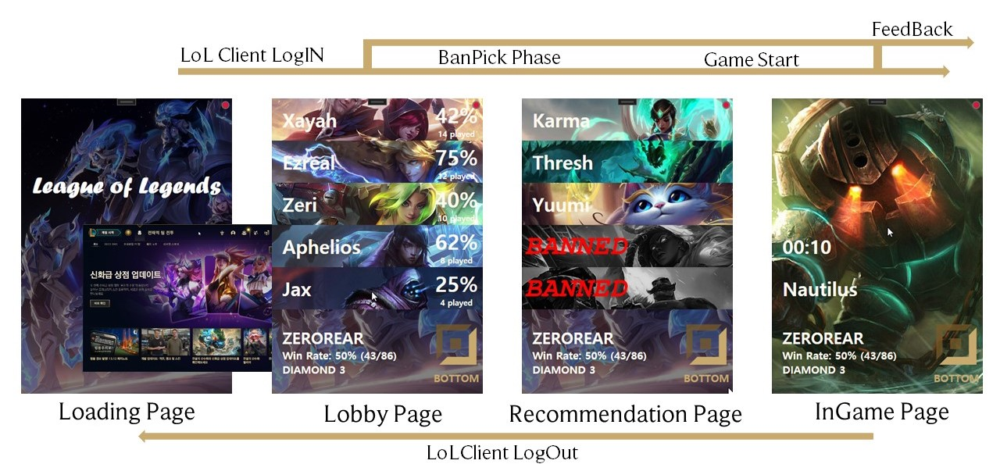

# LoLhelper

## The team
- 권영후 (https://k0hoo.github.io/)
- 이성규 (https://seongq.github.io/)
- 채종욱 
- 이상윤 (https://sangyunl.github.io/) 
 
## Problem definition

게임은 현대 사회에서 모든 연령층에서 사랑받는 즐거운 취미로 자리매김하였습니다. 게임 산업의 급속한 성장으로 인해 게임은 단순한 오락 이상의 다양한 의미를 가지게 되었습니다. 그 중에서도 'League of Legends'(이하 롤)은 현재 가장 인기 있는 게임으로 대한민국의 PC방 점유율 1위를 차지하고 있습니다. 

롤은 163개의 챔피언 중 하나를 선택해야 하는데, 이는 초보 사용자들에게는 어려운 과정일 수 있습니다.

적절한 챔피언 선택은 승리를 위한 전략 수립에 주요한 발판이 됩니다. 그러나 챔피언의 수의 증가와 상성 관계로 인해서 초보 유저들이 승리를 위한 적합한 챔피언 선택에 어려움을 겪고 있습니다. 게임 개발자와 커뮤니티는 초보자를 위한 가이드라인, 튜토리얼, 접근성 향상 기능 등을 제공하여 사용자들이 게임을 쉽게 이해하고 적응할 수 있도록 노력하고 있습니다. 그러나 이러한 노력에도 불구하고 여전히 한계가 있습니다. 

이러한 문제를 해결하기 위해 우리는 'LoLhelper'라는 프로그램을 개발하였습니다.

'LoLhelper'는 사용자가 게임 챔피언을 선택할 때 사용자의 전적 정보와 팀원들과 적군의 챔피언 선택을 실시간으로 고려하여 최적/최악의 챔피언을 제시해줍니다. 이를 통해 사용자들이 겪던 챔피언 선택의 어려움을 해소할 수 있을 것입니다.

## System design

### 1) System Flow

1. LOL을 실행하면 프로세스가 이를 감지하여 사용자를 MainPage로 이동시킵니다.
2. 사용자가 로그인하면 LobbyPage로 이동하여 사용자 정보를 보여줍니다.
3. 사용자가 랭크 게임을 실행하면 클라이언트는 LobbyPage에서 Recommend Page로 이동하여 사용자에게 챔피언을 추천합니다.
4. 게임이 시작되거나 게임이 취소될 경우 다시 LobbyPage로 돌아갑니다.
5. LobbyPage에서 LOL 클라이언트 내에서 로그아웃을 선택하면 MainPage로 넘어갑니다.
6. LOL 클라이언트를 종료하면 해당 프로그램도 종료됩니다.

### 2) System Architecture

프로그램이 RIOT client 및 HPC 서버와 통신하도록 설계되었습니다. 우리의 목표는 게임내의 밴픽현황을 통해서 챔피언을 추천받는 것입니다. 따라서 RIOT client에서 해당 사용자의 정보를 받고 이를 HPC 서버에 전송해서 챔피언을 추천받도록 구성하였습니다. 제안된 시스템에서 HPC 서버는 Flask 프레임워크를 통해서 개발하였으며 HPC 서버내에서 RIOT client로부터 얻은 정보를 토대로 챔피언을 추천하여 전송하게 됩니다. 딥러닝 서버를 별도로 구축함으로써 사용자가 프로그램을 사용하기위한 접근성을 낮췄으며, 사용자로부터 얻은 정보를 수집할 수 있도록 하였습니다.

#### 2-1) Module 1 (Desktop Application ↔ LCU API ↔  RIOT Client)

프로그램의 UI는 **WPF(Windows Presentation Foundation)** ([What is WPF?](https://learn.microsoft.com/en-us/dotnet/desktop/wpf/overview/?view=netdesktop-7.0))로 개발되었습니다. 

#### **Why WPF and Window Application?**

첫번째로, 사용자 인터페이스와 로직을 한 번에 구현할 수 있습니다. XAML(Extensible Application Markup Language)을 사용하여 사용자 인터페이스를 정의하고 코드 비하인드(C# 또는 VB.NET 등)에서 로직을 구현할 수 있습니다. 추천 모델 서버를 따로 운영해야 하는 상황에서 front-end와 back-end를 하나의 도구로 구현할 수 있다는 점이 매력적이었습니다.

두번째는 롤 인터페이스 프로세스와의 직접적인 통신입니다. RIOT GAMES에서 제공하는 LCU([League Client Update](https://riot-api-libraries.readthedocs.io/en/latest/lcu.html))를 통해 롤 클라이언트와 HTTP 양식으로 통신하여 사용자 정보를 주고받습니다. 이러한 작동 방식은 웹과 같은 다른 형태의 UI를 사용하는 것(eg. Web, Mobile App)보다 사용자가 프로그램을 더 쉽게 사용할 수 있도록 만들어주며, 프로그램과 클라이언트 간의 내부 프로세스 통신이기 때문에 빠르고 효율적인 통신이 가능합니다.

#### **How It Works**

**Lobby Page**

프로그램은 롤 클라이언트의 작동 여부를 감지하여 클라이언트가 시작되면 사용자를 식별합니다. 프로그램은 클라이언트로부터 사용자의 이번 시즌 전적을 모두 받아온 후, HTTP 응답 데이터를 JSON 객체로 파싱합니다. 개별 챔피언 별로 전적을 정리하고, 그 중에서 판 수가 가장 많은 챔피언부터 정렬하여 저장합니다. 이후 UI에서는 순서대로 가장 많이 사용한 챔피언(Most Five Champion)을 보여줍니다.

**Recommendation Page**

랭크 게임 시작 시 챔피언 추천이 시작됩니다. 사용자가 어떤 라인으로 게임을 시작하는지(Lane info)를 클라이언트와의 통신을 통해 파악합니다. 프로그램은 1초마다 챔피언 백/픽 데이터를 반복적으로 받아오며, 챔피언 선택에 변화가 생긴 경우에만 HTTP 응답 데이터를 처리하여 서버에 전달합니다. 이렇게 1초마다 발생하는 통신은 인터프로세스 통신이므로 로드가 적어서 효율적입니다. 로드가 큰 서버와의 통신은 챔피언 선택이 변경될 때만 수행하여 로드를 최소화합니다.

**Communication with Server**

건내주는 데이터에는 사용자의 라인, 금지된 10개의 챔피언, 아군이 선택한 챔피언, 적팀이 선택한 챔피언, 사용자가 선택할 수  있는 챔피언이 포함됩니다. 라인 정보를 건내주어 서버가 해당 라인에 적합한 챔피언을 추천할 수 있도록 합니다. 이들은 추천 결과를 얻는 입력 데이터로 사용됩니다.

서버는 추천 챔피언 3개와 비추천 챔피언 2개를 JSON 형식으로 제공하여 실시간으로 프로그램에 전송해줍니다. 프로그램은 이 데이터를 순서대로 UI에 표시합니다. 사용자는 UI에 표시된 추천 챔피언을 클릭함으로써 원하는 챔피언을 선택할 수 있습니다. 프로그램은 이 선택 정보를 HTTP 통신을 통해 서버에 전송합니다. 이를 통해 사용자는 쉽고 빠르게 원하는 챔피언을 선택할 수 있습니다.

**InGame Page**

사용자가 챔피언을 선택하면 해당 챔피언에 대한 정보를 사용자에게 전달하며, 사용자가 게임을 끝 마칠 때까지 대기합니다. 사용자가 게임을 끝내면 승패 데이터를 서버에 전송하여 서버가 추천이 정당한 추천이었는지 판단할 수 있도록 합니다.

#### 2-2) Module 2 (HPC Server)

HPC 서버는 고성능 컴퓨터 서버로서, 딥러닝 모델 제공을 목적으로 사용됩니다. 저희는 Flask 프레임워크를 사용하여 딥러닝 모델을 제공합니다. 모델은 TensorFlow를 사용하여 학습되었습니다. Flask를 선택한 이유는 Python과 TensorFlow와의 호환성을 고려하고, 프로젝트의 규모가 상대적으로 작아서 가볍고 유연한 Flask 프레임워크가 적합하다고 판단했습니다.

클라이언트로부터 전송된 JSON 파일은 HPC 서버에서 전처리 과정을 거치게 됩니다. 전처리는 데이터의 정제, 변환, 스케일링 등을 포함하며, 데이터를 모델이 사용할 수 있는 형식으로 가공하는 작업입니다. 전처리된 데이터는 모델에 입력되어 예측 결과를 반환합니다. 반환된 결과 중에서 상위 3개와 하위 2개를 정렬하여 클라이언트에 다시 전송합니다.

Flask는 요청이 들어온 순서대로 처리되는 단일 스레드 방식을 기본으로 사용합니다. 따라서 다중 사용자가 동시에 HPC 서버에 요청을 보내더라도 순서대로 처리되어 각 사용자에게 모델을 통한 예측 결과가 반환됩니다.

## Data Preparation

### 1) Data Collection

우리는 OP.GG 사이트에서 게임 기록을 수집하기 위해 Selenium을 활용하였습니다. OP.GG에는 다양한 게임 결과가 포함되어 있으며, 이 중에서 저희는 솔로 랭크 게임 데이터만을 수집하였습니다. 일반 게임이나 칼바람 등의 게임 형태는 주로 즐거움을 추구하기 위한 챔피언 선택이 큰 영향을 미치기 때문에, 이러한 게임 기록에서는 승리를 위한 챔피언 선택의 패턴을 파악하기 어려울 것으로 판단되었습니다.

따라서, 저희는 솔로 랭크 게임 데이터를 중점적으로 수집하여 학습에 활용하였습니다. 솔로 랭크 게임은 경쟁적인 환경에서 플레이어들이 최선을 다해 승리를 위해 노력하는 상황을 반영하고 있기 때문에, 게임에서 승리를 위한 챔피언 선택의 패턴을 파악할 수 있을 것으로 기대하였습니다.

그러나, 이러한 데이터 수집 과정에서 몇 가지 문제점이 발생하였습니다. 예를 들어, 일부 게임에서는 데이터가 부족하거나 누락된 경우가 있을 수 있습니다. 또한, OP.GG 사이트의 구조나 업데이트에 따라 데이터 수집에 어려움을 겪는 경우도 있을 수 있습니다. 이러한 문제점들을 인지하고 최대한 해결하기 위해 노력하였으며, 수집된 솔로 랭크 게임 데이터를 효과적으로 활용하여 정확하고 유용한 분석 결과를 도출하는 데 주력하였습니다.

**1. 시간에 따른 데이터의 품질 저하**

LOL은 정기적으로 업데이트가 이루어지며 밸런스 패치를 통해 챔피언의 성능 조절 및 아이템 변경 등이 수정됩니다. 이러한 이유로 과거의 데이터는 현재의 게임 상태와는 더 이상 유의미한 관계를 가지지 않을 수 있습니다. 예를 들어, 이전에 강력한 챔피언으로 알려져 있던 챔피언이 밸런스 패치로 인해 현재에는 그렇게 강력하지 않을 수 있습니다.

우리 팀은 이러한 데이터의 품질 저하 문제를 고려하여 크롤링 일자를 기준으로 최신 7일 이내의 데이터만을 수집하여 학습에 활용하였습니다. 이를 통해 최신 게임 상태에 더 잘 대응하고, 밸런스 조정 등의 변화를 반영한 모델을 구축할 수 있었습니다. 따라서, 우리의 모델은 과거 데이터의 품질 저하로 인한 불필요한 영향을 최소화하고, 현재 게임 상태에 더욱 적합한 예측과 분석을 제공할 수 있습니다.

**2. 라인 스왑**
   
op.gg에서는 게임 기록을 탑, 정글, 미드, 원딜, 서폿 순으로 저장합니다. 그러나 실제 게임에서는 밴픽 단계에서 라인을 스왑하여 원딜 위치에 서포터 챔피언이, 서포터 위치에 원딜 챔피언이 배치되는 경우가 있을 수 있습니다. 이는 데이터 수집 과정에서 잘못된 데이터로 기록될 수 있음을 의미합니다.

우리 팀은 이러한 잘못된 데이터를 처리하는 방법을 고민했습니다. 데이터의 양이 충분하다면 잘못된 데이터는 전체 데이터 중에서 일부이며, 실제 분석 및 학습에 미치는 영향은 제한적일 것으로 예상되었습니다. 따라서, 우리는 해당 데이터를 그대로 수집하여 학습에 활용하기로 결정했습니다. 

이러한 점들을 고려하여서 데이터를 수집하였으며, 결과적으로 저희팀은 챌린저 티어부터 마스터 티어까지 총 5만개의 게임 기록을 수집하였습니다.

### 2) Data Preparation

수집한 데이터는 다시 한번 전처리 과정을 통해서 학습에 사용하였습니다. 데이터는 tier, result, enemy1 ~ enemy5, top, jg, mid, ad, sup 순으로 수집되었습니다. 데이터는 승리, 패배 두 가지 경우에 대해서 모두 수집되었기 때문에 학습을 위해서는 승리 결과에 대한 데이터로 만들어줘야했습니다. 따라서 패배한 게임 기록에 대해서는 enemy1 ~ enemy5와 top ~ sup의 챔피언의 정보를 바꿔주어서 패배에 대한 데이터를 승리에 대한 데이터로 변경해주었습니다.

우리 팀의 모델의 입력은 적 챔피언 5개, 아군 챔피언 5개의 순으로 벡터를 구성해서 들어가게 됩니다. 따라서 크롤링된 데이터에서 다시 해당 정보만 추출해주었습니다. 그리고 크롤링된 데이터는 챔피언의 이름에 대한 정보로 저장이 되었습니다. 따라서 이를 모델의 학습으로 사용하기 위해서는 챔피언의 이름은 챔피언과 매핑되는 id로 변경해주어서 모델의 입력으로 사용할 수 있게 수정해주었습니다.

그리고 모델을 학습하기 위해서는 해당 학습 데이터에 대한 정답 데이터가 쌍으로 존재해야합니다. 자세한 데이터 전처리 결과는 위의 이미지를 참고하세요.

## Model

모델은 선형 레이어를 중첩하여 구현되었으며, 학습 과정은 0 벡터에 적절한 챔피언을 선택하는 것으로 이루어집니다. 입력 벡터에서 빨간색으로 표시된 부분은 적 챔피언의 정보를, 파란색으로 표시된 부분은 아군 챔피언의 정보를 나타냅니다. 적 챔피언 정보는 순서에 상관없이 무작위로 들어가고, 아군 정보는 Top, Jungle, Mid, AD, Sup 순서로 입력 벡터에 할당됩니다. 이 방식으로 벡터의 입력 순서 자체가 적과 아군, 그리고 아군의 역할을 암시하는 정보로 작용합니다.

출력 벡터는 원거리 딜러 포지션을 기준으로 총 26개로 구성되며, 사용자의 포지션에 따라 길이가 변화합니다. 출력 벡터의 순서도 어떤 챔피언을 나타내는지에 대한 정보를 포함하고 있습니다. 예를 들어, 출력 벡터의 4번째 인덱스는 이즈리얼을 표현합니다. 모델은 챔피언의 ID를 학습하는 것이 아니라, 특정 벡터에 1 값을 예측하게 되므로, 이런 방식이 학습의 안정성과 정확도를 향상시키는데 도움이 되었습니다.

초기에 모델을 설계하고 학습할 때, 모델의 손실(loss)이 수렴하지 못하고 발산하는 문제가 발생했습니다. 이 문제를 해결하기 위해 두 가지 방법을 시도했습니다. 첫 번째로, 위에서 언급한대로 출력 벡터(output vector)의 순서 정보를 활용하여 벡터의 값을 챔피언의 id가 아닌 1로 설정했습니다. 이렇게 함으로써 모델이 학습하기 쉽도록 했습니다. 예를 들어, 이전에 1에서 1000 사이의 값을 가졌던 id를 1로 변환했습니다. 두 번째로, 선형 레이어 사이에 배치 정규화(batch normalization) 레이어를 추가하여 값을 너무 크게 만드는 것을 방지했습니다. 이를 통해 값의 스케일을 조절하고, 모델이 안정적으로 학습할 수 있도록 도왔습니다. 위의 두 가지 방법을 통해 모델의 손실이 수렴할 수 있도록 개선했습니다.

출력 레이어의 활성화 함수는 softmax를 사용하였습니다. 분류해야 할 클래스가 다양하므로, 학습 효율을 높이기 위해 softmax 함수를 활용하는 것이 적절하다고 판단했습니다. 실제로, 선형 함수보다는 softmax를 사용한 학습이 더욱 우수한 안정성과 정확도를 보여주었습니다.

## Personalization

모델이 추천해주는 챔피언은 유저의 어떠한 정보도 반영되지 않은 오로지 학습데이터로 인한 결과였습니다. 이러한 챔피언 추천 방식은 유저의 숙련도, 성향 등을 고려하지 않기 때문에 맞춤형 챔피언 추천이라고 할 수 없었습니다. 따라서, 저희 팀은 다음의 식을 도입하여서 우리의 모델을 개인에게 Personalization이 될 수 있도록 하였습니다.

$$ result = \alpha \cdot prediction + (1-\alpha)\cdot \frac {winning\;rate}{max( winning\;rate)}  $$

해당 식에서 result는 최종 결과, prediction은 전처리된 모델의 예측값, alpha는 weight scaling factor의 역할을 합니다. 정규화된 승률은 유저가 플레이한 챔피언들의 승률을 최대 승률로 정규화한 것을 의미합니다. 승률은 10판이상의 플레이한 챔피언들만 반영하여서 적은 판수로 인해서 고승률이 과하게 반영되는 것을 방지하였습니다.

alpha는 prediction의 top3 합으로 구해지게 됩니다. 이때, alpha를 통해서 모델이 예측한 결과 값과 유저의 정보에 해당하는 정규화된 챔피언 별 승률을 조절하게 됩니다. 예측값은 softmax를 한 결과이기 때문에 출력들은 0~1의 값을 갖게 됩니다. 만약 모델이 예측 결과에 확신이 있다면 prediction의 상위 3개의 값의 합은 1에 가까운 값을 갖게 될것입니다. 이러한 경우, 유저 정보에 의한 가중치보다는 모델의 예측한 결과에 가중치를 더 부여해야한다고 판단하였습니다. 그리고 반대의 경우로 전체 출력 값이 비슷하다면 alpha값은 작아지게 될 것입니다. 이러한 경우, 모델이 판단한 결과에 확신이 없다고 해석할 수 있으며 이때는 정규화된 승률에 더 가중치를 주어서 유저 정보를 더 활용해 챔피언을 추천할 수 있도록 하였습니다.

## Application Demonstration

## Feedback after demoday

**1. 중복 챔피언 추천 문제** 

상대팀이 선택한 챔피언을 서버에서 반영하지 못해 이미 선택된 챔피언을 모델이 추천하는 현상이 있었습니다. 이러한 오류는 시스템에 대한 신뢰성을 떨어뜨리게 되며, 이는 사용자의 시스템 만족도 저하로 이어지게 됩니다.
문제를 해결하기 위해서 사용자 클라이언트로부터 밴픽 현황 받고 이를 통해서 모델의 추천 챔피언을 필터링 해줌으로써 해결하였습니다.

**2. Personalization** 

예측된 챔피언이 유저의 챔피언 성향 및 숙련도를 고려하지않고 모델 학습 데이터에 의존적인 결과만 출력한다는 문제점이 있었습니다. 이러한 문제를 위에서 언급한대로 alpha와 정규화된 승률을 도입해서 가중치를 조절하는 방법으로 보완하였습니다. Personalization을 도입한 것으로 기존의 동일한 챔피언 선택상황이 발생하면 동일한 챔피언을 출력해주는 문제에서 사용자의 정보를 반영함으로써 어느정도의 랜덤성도 확보했다고 볼 수 있습니다.

**3. 인게임 페이지**

기존에는 사용자가 챔피언 선택을 마쳐도 의미없는 추천이 이어졌다. 이런 추천이 의미없다는 피드백을 반영하여 사용자의 챔피언 선택 후에 해당 챔피언에 대해 보여주는 페이지(InGame Page)를 추가하였습니다. 해당 페이지에서는 해당 챔피언에 대한 사용자의 전적 통계와 게임이 시작하면 게임 시간을 세줍니다. 이로써 게임이 시작되어도 사용자가 LoLhelper를 끄지 않을 이유의 토대를 만들었습니다.

게임이 끝이 나면 다시 Lobby Page로 돌아가서 갱신된 모스트 챔피언에 대해서 보여줍니다. 이로서 게임 대기, 챔피언 선택, 인게임 상황 루틴에 대한 모든 페이지가 완성되어서 사용자가 게임을 하는 동안 LoLhelper가 사용자 경험을 해치지 않고 도움을 줄 수 있을 것입니다.

또한, 추가적인 사용자 경험 향상이 가능할 것으로 생각하고 있습니다. 챔피언 선택 도우미라는 취지에 맞추어서 사용자 챔피언 선택 후에 선택되는 챔피언(후픽)에 대한 대처 정보들을 알려줄 수 있을 것입니다. 더욱 확장적으로 인게임 정보들을 클라이언트 통신으로 파악하여 아이템/전략 추천이 가능할 것입니다.

**4. 사용자 피드백**

추천 시스템인 만큼 LoLhelper의 효용성에 대한 의문 제기가 많았습니다. 첫째로 적절한 챔피언을 선택해주는지 두번째로 추천 챔피언 선택이 승리를 보장해주는지에 대한 의문입니다. 

인게임 페이지를 통해 게임이 끝이 나는 정보를 파악할 수 있게 되었습니다. 사용자가 추천한 챔피언을 선택한 경우에 대해서만 승패 데이터를 수집합니다. 이를 통해 LoLhelper의 효용성을 파악할 수 있을 것이며 검증된 승패 데이터를 학습에 사용할 수 있을 것입니다.

현재는 사용자가 추천 챔피언을 선택하였는지와 승패여부를 수집하고 있지만 같은 형태로 더욱 다양한 데이터를 수집할 수 있을 것입니다.

## Reflection

**1. 데이터셋: 업데이트 반영과 지속적인 빠른 학습을 위한 전적 데이터 구성**

롤은 시즌별과 버전별로 업데이트가 활발하게 이루어지며, 게이머들은 RIOT GAMES에서 진행한 업데이트 이외에도 지속적으로 새로운 메타 픽과 전략을 개발합니다. 이러한 새로운 전략들은 커뮤니티를 통해 빠르게 전파됩니다. 롤의 전적 데이터는 이러한 정보들이 지속적으로 누적되며, 기존에 학습된 모델은 최신 정보에 대해 제대로 대응하지 못할 수 있습니다. 그러므로 계속해서 자동적으로 새로운 데이터셋을 구성하고, 유효한 데이터로 모델을 주기적으로 학습할 수 있는 파이프라인을 구축해야할 필요성이 있습니다.

**2. 모델: 정확한 추론 vs 빠른 학습과 결과값 도출**

롤에서는 챔피언 선택부터 게임 플레이와 전략이 하나로 결합되어 승패에 중요한 역할을 합니다. 따라서 최적의 챔피언 선택이라고 해도 게임 내 플레이가 부족하다면 패배할 수 있습니다. 또한 챔피언 선택이 좋지 않다고 해도 게이머가 전략을 이해하고 수립한다면 승리할 수도 있습니다. 이에 따라 챔피언 추천은 어떤 챔피언이 좋을지 경향성을 제시하지만 특정 선택을 강요하지는 않습니다. 따라서 승리의 추천이 가능한지는 확답할 수 없습니다. 하지만 빠른 학습과 빠른 결과 도출은 챔피언 추천에서 매우 중요합니다. 롤은 데이터셋이 빠르게 업데이트되므로 학습과 모델 업데이트가 자주 발생하며, 챔피언 선택 시간 동안 최대 10번의 추천을 제공해야 합니다. 따라서 정확한 추론이 가능한 크고 강력한 모델과 빠르게 작업을 수행할 수 있는 가벼운 모델 중에서 최적의 선택을 해야합니다.

**3. 게임 내 역할 변경**

밴픽 상황에서 역할이 변경되는 경우가 발생할 수 있습니다. 예를 들어, 사용자가 원래 TOP을 선택했지만 Jungle로 변경되는 경우입니다. 이런 경우에는 lolhelper가 현재 역할을 감지하지 못하고 계속해서 이전의 TOP 챔피언을 추천하게 될 수 있습니다. 이는 예상치 못한 상황이며 이러한 문제에 대처하기 위한 방법을 고려해야 합니다. 현재 고려하고 있는 방법은 사용자가 lolhelper에게 직접적으로 역할을 지정해주는 것입니다. LCU 서버와의 통신을 통해 역할을 파악하는 것이 아니라 라인 스왑이 발생하면 사용자가 지정한 역할의 챔피언을 추천해주는 방법입니다. 이를 통해 해당 문제를 해결할 수 있을 것으로 보입니다.

**4. 티어 별 공정성 문제**

현재 lolhelper는 챌린저부터 마스터티어까지의 상위 랭크 유저의 게임 기록을 학습 데이터로 사용하고 있습니다. 이는 상위 랭크 유저들이 승리를 추구하는 경향이 크기 때문에 챔피언 선택 결과에는 승리를 위한 패턴이 존재할 것으로 판단되었기 때문입니다. 실제로 이러한 학습 데이터를 사용했을 때 모델의 테스트 정확도가 더 높게 나타났습니다.

그러나 이는 lolhelper가 추천하는 챔피언과 일반 유저의 선호하는 챔피언 사이에 괴리가 있을 수 있다는 의미입니다. 왜냐하면 상위 랭크 유저들은 챔피언의 난이도가 어렵더라도 성능이 좋으면 선호하는 경향이 있기 때문입니다. 예를 들어, 가렌은 상위 랭크 유저들이 선호하지 않는 챔피언입니다. 그러나 일반 유저들은 가렌이 조작이 쉽고 기본 성능이 좋아서 선호하는 경향이 있습니다. 랭크 간의 선호하는 챔피언의 차이로 인해 lolhelper가 추천하는 챔피언이 모든 유저를 만족시킬 수 있는지는 알 수 없습니다.

## Future work

저희 계획은 Reflection에서 제시된 요소들을 하나씩 반영하는 것입니다.
1) 크롤링 및 모델의 주기적인 업데이트를 자동화하여 실시간 데이터를 반영하고 최신 모델을 제공하는 파이프라인을 구축할 계획입니다. 이를 통해 사용자들의 UX를 만족시킬 수 있습니다.

2) 인게임 내 돌발상황을 대처할 수 있는 시스템을 구축할 예정입니다. 게임 상태 모니터링 및 분석 기능을 추가하여 돌발상황을 신속히 감지하고 대응 방안을 제시할 수 있습니다.

3) 티어별로 챔피언을 추천해주는 모델을 학습하여 티어에 맞는 챔피언을 추천할 계획입니다. 사용자의 티어 데이터를 수집하여 해당 데이터를 기반으로 새로운 모델을 학습시켜 정확한 추천을 제공할 수 있습니다.

4) 챔피언 추천 페이지에서 클릭한 챔피언이 인게임 내에서도 반영되도록 개선할 예정입니다. 또한, 챔피언 추천 결과를 확인한 후 사용자의 피드백을 수집하여 시스템의 개선에 반영하는 상호작용을 추가할 계획입니다.

위의 개선 계획을 통해 사용자와 시스템 간의 상호작용을 강화하고 사용자의 경험을 향상시킬 수 있도록 노력하겠습니다.